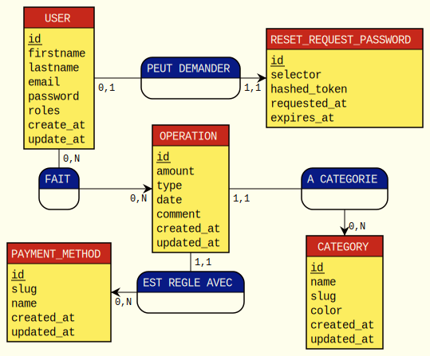

# SP_budget_symfony

## Structure de la base de donnée MCD (fait avec Mocodo)

### Installation du projet
+ Cloner le projet avec `git clone https://github.com/VincentSureau/SP_budget_symfony.git`
+ Installer les dépendances PHP avec `composer install`
+ Copier le fichier `.env` en `env.local` et mettre à jour les variables d'environnement (attention, le fichier .env est suivi par le repository git, ne pas y insérer de données sensibles)
+ Créer la base de donnée avec `php bin/console doctrine:database:create`
+ Mettre à jour le schema de la base de donnée avec la commande `php bin/console doctrine:migrations:migrate`
+ Optionel: Remplir la base de données avec des fausses données: `php bin/console doctrine:fixtures:load`

### Librairies PHP utilisées
- `fzaninotto/faker` pour les fixtures
- `gedmo/doctrine-extensions` et `stof/doctrine-extensions-bundle` pour automatiser la création des slug et des champs created_at et updated_at dans les entity

### Librairies CSS / Javascript utilisées
- `MaterializeCss` pour le framework css
- `Datatable` pour l'affichage des opérations
- `chart.js` pour l'affichage des graphiques
- `Jquery` pour la manipulation du DOM

### Demo
Il est possible de se connecter avec un utilisateur admin:
- username: admin@admin.com
- mot de passe: admin
